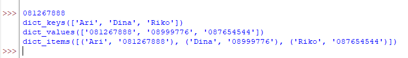
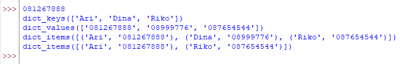

 # Praktikum 6
 ## Latihan 1
 
 ### Buat Dictionary daftar kontak
 #### - Nama sebagai Key dan Nomor sebagai value
 #### - Tampilkan kontaknya Ari
 #### - Tambah kontak baru dengan nama Riko, nomor 087654544
 #### - Ubah kontak Dina dengan nomor baru 088999776
 #### - Tampilkan semua nama
 #### - Tampilkan semua nomor
 #### - Tampilkan daftar Nama dan nomornya

#### - Hapus kontak Dina

## Tugas Praktikum

### Buat Nilai Mahasiswa menggunakan Dictionary
elif List.lower() == 'u':
        print ("Ubah Data")
        nama = input("Masukkan Nama  : ")
        if nama in Data.keys():
            nim = int(input("NIM            :"))
            tugas = int(input("Nilai Tugas    : "))
            uts = int(input("NIlai UTS      : "))
            uas = int(input("Nilai UAS      : "))
            akhir = tugas *30/100 + uts *35/100 + uas *35/100
            Data[nama] = nim, tugas, uts, uas, akhir
        else :
            print("Nama {0} tidak ditemukan".format(nama))
